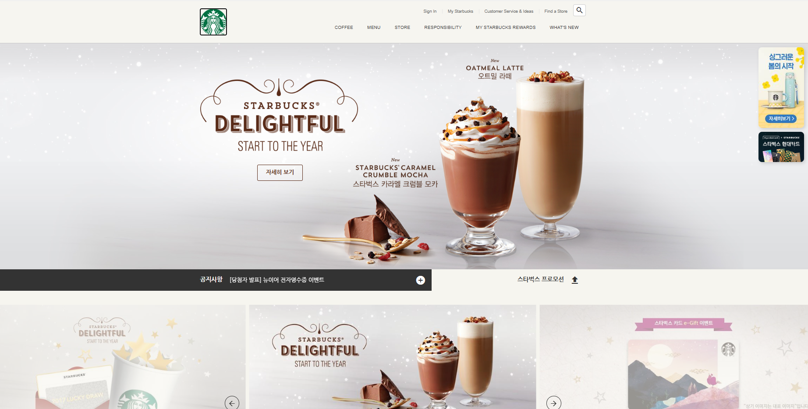

# ☕️ 스타벅스 클론코딩

HTML, CSS, JavaScript를 활용한 스타벅스 공식 홈페이지 클론코딩 프로젝트입니다.

---

## 👤 프로젝트 개요

- **개발 인원:** 1인 (개인 프로젝트)
- **작업 기간:** 약 2개월

---

## 🛠️ 사용 기술

- HTML5
- CSS3
- JavaScript (Vanilla JS)

---

## 📝 주요 기능

- 스타벅스 공식 홈페이지 메인 화면 클론
- 상단 네비게이션/푸터 구현
- 메뉴, 배너, 이벤트 섹션 등 레이아웃 구성
- Swiper를 이용한 배너 슬라이드

---

## 📂 프로젝트 구조

├─ index.html
├─ css/
│ └─ main.css
├─ js/
│ └─ main.js
├─ images/
│ └─ main.png

---

## 🖼️ 스크린샷

---

## 🏃‍♂️ 실행 방법

1. 프로젝트를 클론 또는 다운로드합니다.
2. `index.html` 파일을 더블클릭하거나, 브라우저에서 엽니다.
3. Live Server를 눌러 실행한다

---

## 💡 기타

- 본 프로젝트는 포트폴리오 및 학습 목적의 개인 프로젝트입니다.
- 모든 디자인 저작권은 스타벅스에 있습니다.
